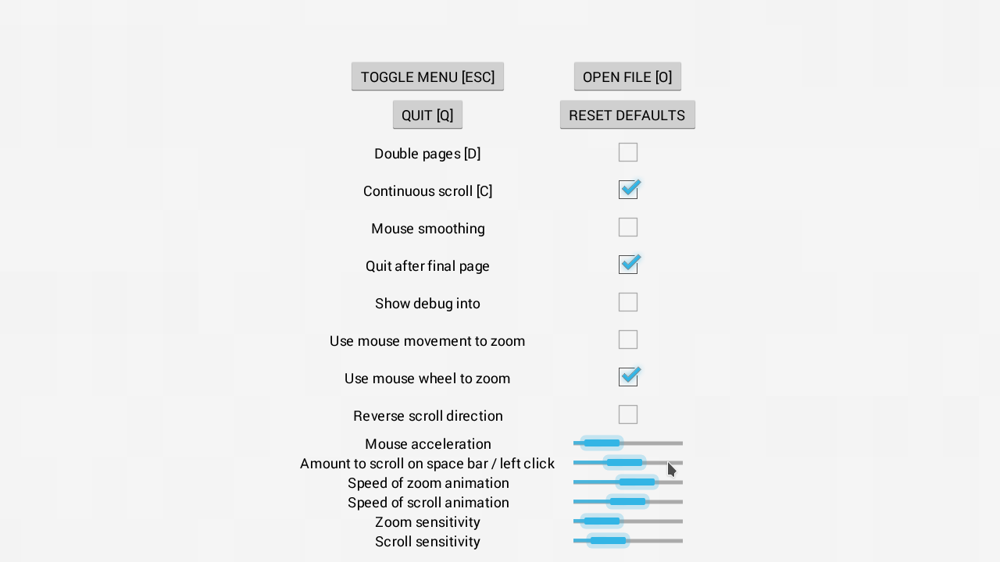

ComicReaderUltimate (CRU) is the modern successor to ComicReaderPro, one of the earliest programs for reading comics in CBR, CBZ or JPEG format on Windows, Mac and Linux.

* Multi-threaded for fast loading
* GPU accelerated rendering
* View single or double pages
* View pages separately or in a continuous scroll

CRU is highly configurable - you can tweak values to find the most natural reading experience.  
However, it is also highly *opinionated*.  It always runs fullscreen because that is the best 
way to read comics.  There is limited GUI because you are expected to learn the mouse or 
keyboard controls.  There is no library browser because your operating system should already 
have file manager.

CRU is optimized to be as fast and responsive as possible on modern systems without worrying if it will run on legacy hardware.
This comes at the cost of memory usage - it is assumed you have at least 4GB of RAM and a modern GPU with 2GB of VRAM.
(CRU makes some effort to optimize for battery power but performance comes first.)  

## Keys

| Function | Keys |
| ---------| --- |
| Quit | Q |
| Open file | O, L |
| Menu | Escape, Tab |
| |  |
| Scroll | Cursor keys |
| First page | Home |
| Last page | End |
| Next page | Page Down |
| Prev page | Page Up |
| Next screen | Space |
| | |
| Zoom in | + |
| Zoom out | - |
| Zoom to fit | Z |
| Zoom default | R |
| | |
| Double pages | D |
| Bilinear filter | B |
| Continuous scroll | C |

     

## TODO
* Android and iOS versions
* Windows testing, installer and file associations
* Optimizations for integrated GPU

Building:

    ./gradlew dist

To build and install a flatpak from the latest Git source:

    flatpak-builder --force-clean --user --install flat-build uk.co.electronstudio.ComicReaderUltimate-github.json